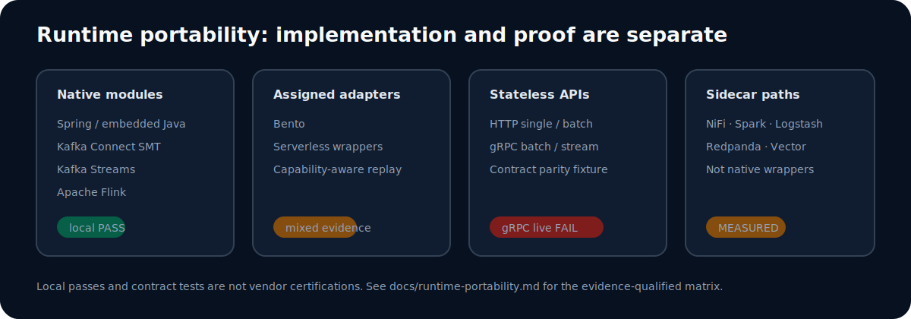

# FlowPlane: governed transformations with preserved runtime evidence

FlowPlane is a pre-GA control plane and Java execution engine for authoring, simulating, approving, deploying, observing, and rolling back field-level stream transformations. Production payloads remain inside the customer-owned runtime boundary; the control plane distributes versioned artifacts and receives operational telemetry.

> **Evidence status:** This repository distinguishes implemented code paths, contract tests, live local integration proofs, measured-but-incomplete runs, and failed gates. It does not claim vendor certification or production readiness.

## 30-second demo

[](assets/demo.mp4)

## The problem

Transformation logic is often duplicated across connectors, stream processors, sidecars, and serverless handlers. That makes policy review, rollout, rollback, runtime parity, and audit evidence difficult. FlowPlane separates a governed mapping lifecycle from execution while preserving an explicit contract between them.

## How it works

1. Authors create versioned mappings with validation, transforms, and policy rules.
2. Simulation shows before/after payloads, field failures, policy results, and latency before publication.
3. Approval and deployment gates produce an immutable artifact.
4. A customer-owned runtime polls for assignments, verifies the artifact, executes locally, and reports bounded telemetry and canonical failures.
5. Operators inspect drift, failures, rollout state, and evidence, then promote or roll back.


See [How it works](docs/how-it-works.md) and [Architecture](docs/architecture.md).

## Runtime portability

Native execution modules exist for the embedded Java/Spring path, Kafka Connect SMT, Kafka Streams, and Flink. Assigned adapters exist for Bento and serverless wrappers. Generic HTTP provides stateless synchronous execution; sidecar paths extend access to other tools without making them first-class native integrations.



The [runtime portability matrix](docs/runtime-portability.md) separates source support from live proof status.

## Key measured results

| Evidence | Workload | Result | Status |
|---|---|---:|---|
| Kafka/Flink local soak | 30 min, 102,400-byte records, 600 target records/s | 1,080,001 produced; 1,069,201 output; 10,800 intentional failures; final lag 0 | Passed accounting gate |
| Core engine, 1 MiB | 976 mapped fields, full parse/transform/serialize | 0.504 ms mean; p99 1.300 ms; 188 KB/op | **Provisional rejected**: 3/12 repeatability gates missed |
| Payload scaling | 1-64 MiB; same 976-field mapping | 0.473-19.387 ms mean; linear fit R² 0.9989 | Controlled local measurement |
| Live Flink transform | 1 MiB, 1,001 outputs | p50 2.512 ms; p95 11.438 ms; p99 17.294 ms; DLQ 0 | Local Docker proof |
| Runtime output parity | Java, HTTP single/batch, gRPC batch/stream contract modes | Identical valid-output SHA-256 | Contract test, not live gRPC proof |

The payload-scaling allocation result is intentionally narrow: allocation stayed near 189 KB/op because the grown bulk field was unreferenced. A realistic referenced 16 MiB field produced a 17.2 MB output, took 178.765 ms, and allocated 182,349,417 B/op. Read [benchmark interpretation](docs/benchmark-interpretation.md) before comparing numbers.

## Governance and security

The implementation includes versioned drafts, optimistic concurrency and autosave, compile validation, approval/QA/PII/schema/replay/deployment gates, immutable artifacts, staged rollout, drift detection, rollback, tenant-aware RBAC, JWT/OIDC session controls, audit export, one-time runtime credentials stored as hashes, short-lived runtime tokens, and encryption for sensitive persisted or cached values.

Raw payload snippets and redrive payload retention are off by default. These are implemented controls, not an external security certification. See [Governance and security](docs/governance-and-security.md) and [Security policy](SECURITY.md).

## Evidence index

- [Evidence index](evidence/evidence-index.md)
- [Claims matrix](evidence/claims-matrix.csv)
- [Core engine](evidence/core-engine/summary.md)
- [Payload scaling](evidence/payload-scaling/summary.md)
- [Kafka soak](evidence/kafka-soak/summary.md)
- [Live Flink runtime](evidence/live-flink-runtime/summary.md)
- [Runtime parity](evidence/runtime-parity/summary.md)
- [Integration proofs](evidence/integration-proofs/README.md)
- [Checksums](evidence/checksums.sha256)

## Limitations and status

FlowPlane is under active development and pre-GA. The latest controlled 1 MiB core publication candidate is not publication-eligible because three repeatability gates failed. The preserved live gRPC attempt returned `UNIMPLEMENTED`; gRPC parity here is an in-process contract result only. Several adapter runs are measured but incomplete. Local Docker and emulator proofs are not managed-cloud certifications. See [Limitations](docs/limitations.md).

## Verify the repository

```bash
python scripts/validate-evidence.py
sh scripts/verify-checksums.sh
```

## Contact

Open a GitHub issue for evidence questions or responsible disclosure guidance. For security vulnerabilities, follow [SECURITY.md](SECURITY.md).
