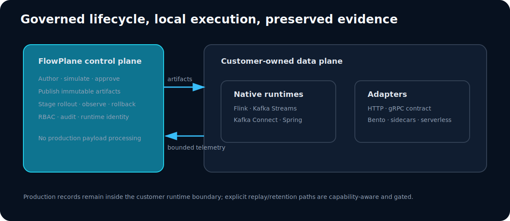
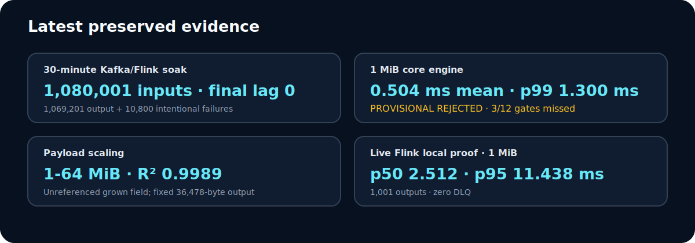

# Flowplane

Flowplane is a governed transformation platform that lets teams define a mapping once and execute the same versioned artifact across Kafka, Flink, Java, HTTP, gRPC, and other compatible runtimes.

Flowplane owns transformation semantics. The host runtime owns transport, delivery, retries, acknowledgements, checkpoints, ordering, backpressure, and state.

This separation gives teams one place to author, validate, approve, version, deploy, observe, and roll back transformation logic without forcing every data system to adopt a new transport or connector model.

[Watch the full live walkthrough](assets/flowplane-live-screen-demo-motion.mp4) · [Read the walkthrough](docs/live-demo.md) · [See how it works](docs/how-it-works.md) · [Inspect the evidence](evidence/integration-proofs/EVIDENCE-OVERVIEW.md)

## Why Flowplane exists

Transformation logic is commonly duplicated across Kafka Connect, Flink, Spark, NiFi, application services, and sidecars. Each copy evolves separately. Moving a workload often requires rewriting mappings, rebuilding validation behavior, and recreating error handling in another framework.

That creates predictable problems:

- mappings drift between runtimes;
- migrations require transformation rewrites;
- approvals, audit history, and rollback become fragmented;
- validation and record-level error behavior become inconsistent; and
- transport technology starts to dictate transformation language.

Flowplane separates transformation logic from the runtime that moves the data. Teams govern an immutable mapping artifact centrally, then execute that artifact inside the runtime boundary appropriate for the workload.

## Architecture

Flowplane has three layers with deliberately different responsibilities.

| Layer | Responsibilities |
|---|---|
| **Control plane** | Authoring, simulation, validation, approval, versioning, deployment coordination, audit history, and bounded operational telemetry |
| **Transformation runtime** | Artifact identity and integrity verification, compiled mapping execution, field validation, transformation policies, and canonical success or error results |
| **Host integration** | Sources and sinks, delivery, retries, acknowledgements, checkpoints, backpressure, ordering, and state |

```text
Control plane
  author → simulate → validate → approve → version → deploy → observe
                                │
                                ▼
Versioned mapping artifact
                                │
                                ▼
Transformation runtime
  verify artifact → execute compiled mapping → apply validation/policy
                                │
                        success or error result
                                │
                                ▼
Host integration
  source/sink → delivery → retry → acknowledgement → checkpoint/state
```

The control plane does not need to become the production payload path. A separately deployed data-plane runtime retrieves and verifies the assigned artifact, executes it locally, and reports bounded operational state. The surrounding host remains responsible for moving records and applying its native delivery guarantees.



Read [Architecture](docs/architecture.md), [How it works](docs/how-it-works.md), and [Governance and security](docs/governance-and-security.md) for the detailed model.

## Live product walkthrough

[](assets/flowplane-live-screen-demo-motion.mp4)

The [19½-minute captioned walkthrough](assets/flowplane-live-screen-demo-motion.mp4) follows one mapping through simulation, approval, publication, deployment, runtime processing, failure handling, version evolution, compatibility gates, telemetry, and audit history. One Kafka Connect Mongo sink and one Flink job independently process the same raw Kafka inputs. The producer scripts write only to the raw topic; the runtimes create the transformed, DLQ, and Mongo results shown in the recording.

Read the [scene-by-scene walkthrough and proof boundary](docs/live-demo.md), inspect its [provenance manifest](evidence/live-demo/video-manifest.json), or review [how the video was produced](reproduction/live-demo-video/README.md).

## Execution modes

The same governed artifact can be used through native runtime modules, protocol surfaces, or tool-hosted pipelines. Qualification details and exact tested boundaries live in the [runtime portability matrix](docs/runtime-portability.md) and [integration evidence overview](evidence/integration-proofs/EVIDENCE-OVERVIEW.md).

### Native

- Embedded Java and Spring
- Kafka Connect
- Kafka Streams
- Apache Flink

### Protocol

- HTTP single-record execution
- HTTP batch execution
- gRPC batch execution
- gRPC bidirectional streaming
- AWS Lambda, Azure Functions, and Google Cloud Functions HTTP wrappers

### Tool-hosted

- Apache Pulsar
- Apache NiFi
- Apache Spark Structured Streaming
- Apache Camel
- Redpanda Connect
- Logstash
- Apache Beam
- Vector
- OpenTelemetry Collector
- Debezium
- Spring Cloud Stream
- Bento and WarpStream-compatible pipelines
- ActiveMQ Classic and Artemis, NATS JetStream, Redis Streams, RabbitMQ Streams, EMQX/MQTT, and RocketMQ pipelines
- Azure Queue, Azure Event Hub, and GCP Pub/Sub event handlers through local provider emulators

Third-party names identify technical execution paths. They do not imply sponsorship, endorsement, partnership, or vendor certification.

## What makes Flowplane different

- **One governed mapping artifact across runtimes.** Author and approve transformation behavior once, then use the same artifact identity across supported execution modes.
- **No connector ownership.** Flowplane supplies transformation semantics without replacing the connector, broker, stream processor, or application that owns delivery.
- **No central payload-movement requirement.** Payloads can remain inside the separately deployed data-plane boundary while the control plane manages artifacts and bounded telemetry.
- **Reduced transformation-language lock-in.** Mappings are not tied to the configuration language of a single connector or processing framework.
- **Artifact identity and drift detection.** Runtime assignment and artifact hashes make the deployed transformation version inspectable.
- **Consistent record-level outcomes.** Validation, transformation, and error policies follow the artifact rather than being reimplemented by every host.
- **High-performance compiled execution.** Mappings are compiled before record execution and measured across complex and large-payload workloads.
- **Evidence-backed interoperability.** This repository preserves the inputs, outputs, runtime state, checksums, and reproduction material behind its public claims.

## Performance summary

The strongest preserved measurements are:

| Workload | Preserved result |
|---|---|
| 1 MiB input, 976 compiled mapping fields | **0.504 ms mean**, **1.300 ms p99**, approximately **188 KB allocated per operation** |
| Fixed 976-field mapping, 1–64 MiB payloads | Near-linear measured scaling, with **R² 0.9989** |
| Local Kafka/Flink soak | **1,080,001 records** with exact success/error accounting and final broker lag zero |

The core benchmark includes full input scanning, parsing, mapping, transforms, policies, bounded error handling, and owned-output serialization. The payload-scaling fixture keeps transformed output size constant, so it measures input growth rather than proportional output materialization. Benchmark and live-runtime numbers describe different boundaries and should not be compared as if they were the same test.

Inspect the supporting material:

- [Benchmark methodology](docs/benchmark-methodology.md)
- [Benchmark interpretation guide](docs/benchmark-interpretation.md)
- [Raw benchmark and integration evidence](evidence/evidence-index.md)
- [Core benchmark qualification report](docs/repeatability-qualification.md)

## What has been proven

The repository preserves evidence for controlled transformation benchmarks, payload scaling, deterministic contract outputs, a 1.08 million-record Kafka/Flink soak, local runtime surfaces, provider-emulated event handlers, and a broad set of streaming and tool-hosted integrations.

The current local-integration supplement contains 38 checksum-verified bundles with 53,630 attempted inputs, 52,800 transformed outputs, 830 intentional error outputs, and 62 bundle screenshots. Thirty-four bundles meet the repository's live-local qualification gates. Four focused tool runs retain exact output/error accounting but are not fully qualified because broker-derived final-lag rows were not preserved.

Those details matter when evaluating a specific runtime, but they do not need to dominate the product introduction. Use the linked evidence matrix for the exact status, boundary, fixture, limitations, and historical context of each claim.



## Inspect the evidence

The repository contains preserved local integration runs, exact record accounting, canonical output comparisons, DLQ results, runtime identity, artifact hashes, broker or provider state, screenshots, sanitized logs, checksums, reproduction scripts, and historical failures.

| Start here | What it contains |
|---|---|
| [Evidence overview](evidence/integration-proofs/EVIDENCE-OVERVIEW.md) | Tested integration paths, preferred runs, screenshots, and proof boundaries |
| [Claims matrix](evidence/claims-matrix.csv) | Public claims mapped to evidence and current status |
| [Scope and limitations](docs/limitations.md) | Boundaries, exclusions, and claims that are not made |
| [Historical attempts](evidence/historical-attempts/README.md) | Preserved incomplete, failed, and superseded runs |
| [Reproduction guide](reproduction/README.md) | Commands, fixtures, and validation workflow |
| [Evidence manifest](evidence/manifest.json) | Release identity, run inventory, and immutable references |
| [Checksums](evidence/checksums.sha256) | Repository evidence integrity inventory |

Evidence release `evidence-2026.07.2` covers preserved work from 2026-07-11 through 2026-07-21 UTC and references Flowplane source revision `10a26df`. Status definitions, dirty-worktree disclosures, emulator boundaries, broker-lag requirements, and other qualification details are maintained in the [evidence classification guide](docs/evidence-classification.md) and evidence-specific documents.

To validate the repository locally:

```bash
python scripts/validate-live-local-evidence.py
python scripts/validate-evidence.py
sh scripts/verify-checksums.sh
```

All published fixtures use synthetic data. Results apply only to their documented workload, execution boundary, and environment.

## Scope and non-goals

Flowplane does not replace:

- Kafka or another message broker;
- Flink, Spark, or another stateful stream-processing engine;
- NiFi or another orchestration and dataflow system;
- connectors, source systems, or sink systems;
- delivery, retry, acknowledgement, ordering, or checkpoint logic; or
- host-owned state and backpressure control.

Flowplane provides the governed transformation layer used by those systems.

This public evidence repository also excludes Flowplane's production source code, complete transformation grammar, compiler and parser implementation, optimization strategy, persistence model, production infrastructure, authentication material, and proprietary mapping artifacts. See [Scope and limitations](docs/limitations.md).

## Repository navigation

- [`docs/architecture.md`](docs/architecture.md) — system boundaries and component responsibilities
- [`docs/live-demo.md`](docs/live-demo.md) — full live workflow, chapter guide, and proof boundary
- [`docs/how-it-works.md`](docs/how-it-works.md) — mapping lifecycle from authoring through runtime execution
- [`docs/runtime-portability.md`](docs/runtime-portability.md) — execution modes and latest preserved local evidence
- [`docs/governance-and-security.md`](docs/governance-and-security.md) — artifact, access-control, audit, and telemetry model
- [`docs/limitations.md`](docs/limitations.md) — evidence scope and non-goals
- [`evidence/integration-proofs/EVIDENCE-OVERVIEW.md`](evidence/integration-proofs/EVIDENCE-OVERVIEW.md) — integration proof index
- [`evidence/claims-matrix.csv`](evidence/claims-matrix.csv) — claim-to-evidence mapping
- [`reproduction/README.md`](reproduction/README.md) — reproduction and verification entry point

## Contact

Open a GitHub issue for evidence questions. For security vulnerabilities, follow [SECURITY.md](SECURITY.md).
