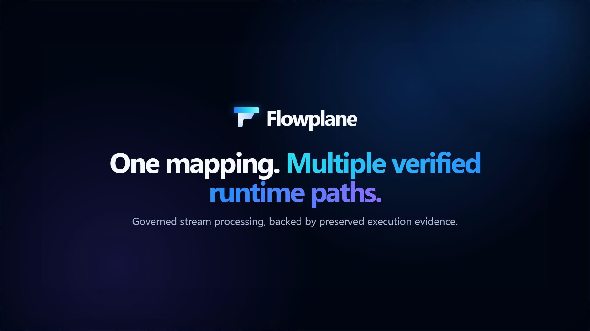

# Flowplane: governed transformations with verifiable runtime evidence

**Define a transformation once, govern it centrally, and execute the same versioned artifact across multiple streaming runtimes with deterministic behavior.**

Flowplane is a governed transformation control plane and portable Java execution engine for authoring, validating, approving, deploying, observing, and rolling back field-level stream transformations. Production payloads remain inside the runtime boundary. The control plane distributes versioned artifacts and receives bounded operational telemetry.

> **Evidence policy:** Every result in this repository is classified by execution boundary and verification level: controlled benchmark, live local integration, contract test, incomplete run, or preserved failure. Each claim links to its methodology, environment, and raw evidence.

## 30-second demo

[](assets/demo.mp4)

| Core engine | Payload scaling | Streaming soak | Runtime parity |
|---|---|---|---|
| **0.504 ms mean** for the documented 1 MiB workload | **1–64 MiB** measured with R² 0.9989 | **1,080,001 inputs** with exact accounting and final lag 0 | **5 contract modes** produced identical valid output |
| `MEASURED_NOT_QUALIFIED` | `MEASURED` | `LIVE_LOCAL_VERIFIED` | `CONTRACT_VERIFIED` |

## What Flowplane solves

Transformation logic is often duplicated across connectors, stream processors, sidecars, and serverless handlers. That makes policy review, rollout, rollback, runtime parity, and audit evidence difficult. Flowplane separates governed mapping management from execution while preserving an explicit contract between them.

## What has been demonstrated

### Core-engine performance

The controlled benchmark completed successfully at 0.504 ms mean, 1.300 ms p99, and approximately 188 KB allocated per operation for the documented 1 MiB, 976-field workload. Nine of twelve repeatability checks met their configured thresholds. Three cross-run mean-stability checks exceeded the 5% tolerance: one success-path comparison and two bounded-error comparisons.

These misses concern run-to-run variance. They do not indicate incorrect transformation output, operation failures, crashes, or failed correctness tests. [Understand the repeatability qualification](docs/repeatability-qualification.md).

### Payload-size scaling

The frozen 976-field workload measured 0.473 ms at 1 MiB and 19.387 ms at 64 MiB. Its linear fit was R² 0.998895. The added bulk field was scanned but not referenced, and normalized output remained 36,478 bytes.

### Streaming soak and accounting

The 30-minute local Kafka/Flink run produced 1,080,001 synthetic 102,400-byte records. It emitted 1,069,201 successful outputs and 10,800 intentional failures, with final lag zero.

### Cross-runtime deterministic behavior

A fixed mapping and fixture produced the same valid-output SHA-256 through embedded Java, HTTP single, HTTP batch, gRPC batch, and gRPC stream contract modes. This is contract verification, not a live gRPC deployment claim.


## Architecture

1. Authors create versioned mappings with validation, transforms, and policy rules.
2. Simulation shows before/after payloads, field failures, policy results, and latency.
3. Approval and deployment controls produce an immutable artifact.
4. A customer-owned runtime verifies and executes the artifact locally, then reports bounded telemetry and canonical failures.
5. Operators inspect drift, failures, and rollout state, then promote or roll back.


See [How it works](docs/how-it-works.md) and [Architecture](docs/architecture.md).

## Runtime evidence matrix

### Native runtimes

| Runtime | Execution path | Evidence status |
|---|---|---|
| Embedded Java / Spring | In-process native engine | `LIVE_LOCAL_VERIFIED` |
| Kafka Connect SMT | Native connector transform | `LIVE_LOCAL_VERIFIED` |
| Kafka Streams | Native topology integration | `LIVE_LOCAL_VERIFIED` |
| Apache Flink | Native map/runtime integration | `LIVE_LOCAL_VERIFIED` |

### Flowplane protocols

| Protocol | Execution path | Evidence status |
|---|---|---|
| HTTP single | Stateless synchronous API | `INCOMPLETE` for the latest full run; contract fixture verified |
| HTTP batch | Stateless batch API | `LIVE_LOCAL_VERIFIED` |
| gRPC batch | In-process service contract | `CONTRACT_VERIFIED`; live attempt is `PRESERVED_FAILURE` |
| gRPC streaming | In-process streaming contract | `CONTRACT_VERIFIED`; live attempt is `PRESERVED_FAILURE` |

### Tool interoperability

| Tools | Execution path | Evidence status |
|---|---|---|
| Bento and Pulsar bridge | Assigned adapter / HTTP bridge | `LIVE_LOCAL_VERIFIED` for small local fixtures |
| NiFi, Spark, Redpanda Connect, Logstash, Vector | HTTP or sidecar | `MEASURED` |
| Camel, Beam, Spring Cloud Stream, Debezium, OpenTelemetry | HTTP or framework integration | `MEASURED` |
| Serverless wrappers | Assigned AWS, Azure, and GCP wrappers | `NOT_TESTED` as a single cross-cloud qualification suite |

See the full [runtime portability matrix](docs/runtime-portability.md) and [historical attempts](evidence/historical-attempts/README.md). No vendor certification is claimed.

## Benchmark results

### Core engine: 1 MiB workload complexity

```text
Input:                1,049,487 bytes
Input variants:       100
Compiled mappings:    976
Execution:            full scan/parse/transform/policies/errors/serialize
Success mean:         503.620 µs
Success p99:          1,300.480 µs
Allocation:           187,999.9 B/op
Correctness tests:    174 passed
Repeatability:        9/12 checks met
```

| Evidence | Workload | Result | Qualification |
|---|---|---:|---|
| Core engine, 1 MiB | 976 mapped fields; full scan, parse, transform, policy handling, and serialization | 0.504 ms mean; 1.300 ms p99; ~188 KB/op | `MEASURED_NOT_QUALIFIED`: benchmark completed; three cross-run mean-stability checks exceeded tolerance |
| Payload scaling | 1–64 MiB; same 976-field mapping | 0.473–19.387 ms mean; linear fit R² 0.9989 | `MEASURED` |
| Kafka/Flink local soak | 30 min; 102,400-byte records; 600 target records/s | 1,080,001 produced; 1,069,201 output; 10,800 intentional failures; final lag 0 | `LIVE_LOCAL_VERIFIED` |
| Live Flink transform | 1 MiB; 1,001 outputs | p50 2.512 ms; p95 11.438 ms; p99 17.294 ms; DLQ 0 | `LIVE_LOCAL_VERIFIED` |
| Runtime output parity | Java, HTTP single/batch, gRPC batch/stream contract modes | Identical valid-output SHA-256 | `CONTRACT_VERIFIED` |

Allocation depends on whether large fields are referenced and materialized. The scaling fixture intentionally held output size constant; see the [interpretation guide](docs/benchmark-interpretation.md) for a referenced 16 MiB-field measurement.

### Measured boundaries

| Evidence | Input boundary | Output boundary | Included work | Excluded work | Environment | Status |
|---|---|---|---|---|---|---|
| Core-engine JMH | Raw input bytes | Owned serialized output bytes | Scan, parse, mapping, transforms, policies, bounded errors, serialization | Compilation, corpus generation, network, broker, runtime wrapper | Windows 11; Oracle JDK 21.0.9; HotSpot/G1 | `MEASURED_NOT_QUALIFIED` |
| Live Flink runtime | Kafka input record | Runtime output/DLQ record | Kafka consumption, runtime execution, serialization, relevant runtime effects | Producer creation and unrelated control-plane work | Local Docker; four Kafka partitions | `LIVE_LOCAL_VERIFIED` |
| Kafka/Flink soak | Producer submission | Final output/error accounting and lag | Producer acknowledgements, broker behavior, consumer/runtime processing, drain | Isolated engine attribution | Local Docker; 30-minute sustained run | `LIVE_LOCAL_VERIFIED` |

Charts: [mean scaling](evidence/payload-scaling/charts/mean-latency.svg), [representative tail latency](evidence/payload-scaling/charts/tail-latency.svg), [allocation scaling](evidence/payload-scaling/charts/allocation.svg), and [soak accounting/lag](evidence/kafka-soak/charts/accounting-and-lag.svg).

## Governance

- Versioned mapping management
- Segregated approval and deployment controls
- Immutable artifacts and integrity verification
- Tenant- and workload-aware access controls
- Staged deployment and rollback
- Auditability and bounded telemetry
- Payload-retention minimization

Detailed implementation controls remain in [Governance and security](docs/governance-and-security.md).

## Evidence and verification

- [Evidence classification](docs/evidence-classification.md)
- [Evidence manifest](evidence/manifest.json)
- [Evidence index](evidence/evidence-index.md)
- [Claims matrix](evidence/claims-matrix.csv)
- [Core benchmark qualification](docs/repeatability-qualification.md)
- [Runtime parity matrix](evidence/runtime-parity/parity-matrix.csv)
- [Checksums](evidence/checksums.sha256)
- Release: [`evidence-2026.07.1`](https://github.com/Flowplane/flowplane-enterprise-benchmark-evidence/releases/tag/evidence-2026.07.1)

```bash
python scripts/validate-evidence.py
sh scripts/verify-checksums.sh
```

## Public evidence boundary

This repository intentionally excludes Flowplane’s production source code, compiler and parser implementation, complete transformation grammar, optimization strategy, persistence model, production infrastructure, authentication material, and proprietary mapping artifacts. Published fixtures are synthetic and simplified.

## Scope and limitations

Results apply only to their documented fixtures, boundaries, and environments. Core JMH and live runtime measurements are not interchangeable. Local Docker and emulator results are not managed-cloud certification. Contract verification is separate from live deployment proof. No universal throughput, runtime-equivalence, security-audit, or vendor-certification claim is made. See [Scope and limitations](docs/limitations.md).

## Contact

Open a GitHub issue for evidence questions. For security vulnerabilities, follow [SECURITY.md](SECURITY.md).
