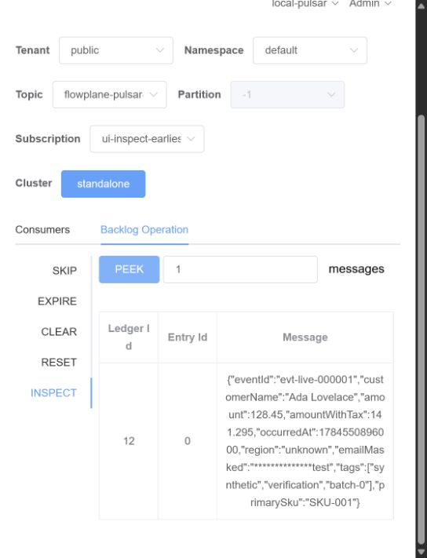

# Apache Pulsar live-local verification

Status: `LIVE_LOCAL_VERIFIED`

The complete checksum-verified run bundle is preserved at [`runs/20260720T135944Z/`](runs/20260720T135944Z/summary.md). It includes the raw outputs, expected outputs, 26-gate result, write-boundary audit, broker metrics, runtime logs, environment, reproduction command, screenshots, and `hashes.sha256`. See the [all-integration evidence overview](../EVIDENCE-OVERVIEW.md) for comparison with the other proven tools and runtime surfaces.

This evidence covers one narrow local Docker boundary:

```text
raw-only producer
  -> persistent Apache Pulsar raw topic
  -> independent Pulsar pipeline container
  -> Flowplane HTTP sidecar /transform endpoint
  -> persistent Pulsar transformed or DLQ topic
```

## Observed live run

The run published 110 synthetic records only to the raw Pulsar topic. The pipeline processed those records through the Flowplane sidecar and produced:

| Result | Count |
|---|---:|
| Transformed topic records | 100 |
| Intentional-invalid DLQ records | 10 |
| Unexpected failures | 0 |
| Final pipeline lag | 0 |

The verifier did not insert records into either downstream topic. Those writes were performed by the independent pipeline after it received the Flowplane sidecar response.

## Pipeline implementation proof

The exact pipeline used for the run is preserved as [`pulsar-flowplane-pipeline.mjs`](pulsar-flowplane-pipeline.mjs) with SHA-256:

```text
0a0f3d546f8a01fd0c2e7ba932648914ee2a76449686475eb382f80c038d8c5f
```

The script:

1. consumes messages from the persistent raw Pulsar topic;
2. calls the supplied Flowplane sidecar URL with `fetch(runtimeUrl, { method: "POST", ... })`;
3. publishes HTTP `200` responses to the transformed topic;
4. publishes intentional HTTP `422` responses to the DLQ topic; and
5. acknowledges each raw message only after its downstream publish succeeds.

This is the direct implementation evidence that the Flowplane HTTP adapter was on the processing path and that the test producer did not manually populate the downstream topics.

## Pulsar Manager inspection

The screenshot shows the transformed topic persisted with 100 entries and displays the first transformed JSON message:



The screenshot was captured after the live run for visual inspection. It supports the pipeline evidence but is not a performance measurement.

## Scope

This classification applies only to the tested local setup: Apache Pulsar 4.2.3, an independent Node pipeline container, and a Flowplane HTTP sidecar. It does not claim Pulsar Functions support, Pulsar IO connector certification, managed Pulsar qualification, multi-broker failover, sustained throughput, vendor certification, sponsorship, or endorsement.
